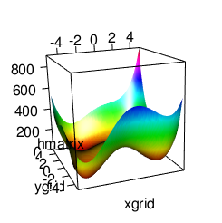
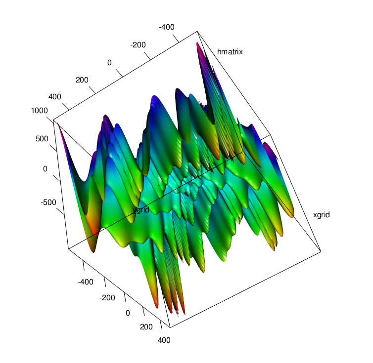
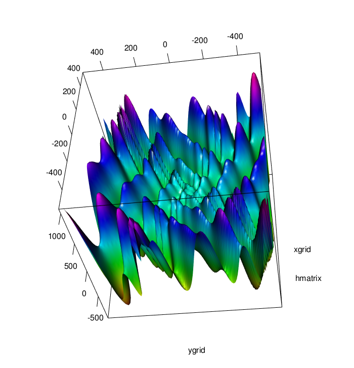

```{r}
rm(list=ls()) # clear the workspace.. always a good idea before you start a new project
set.seed(321) # so we will all be talking about the same random results
setwd("/home/harm/Uni/cogmod/LC1") # set to your working dir with the files you need. 
```

# 1 creating a function
Creating functions in R is easy. The basic structure is:  
*function_name* <- __function__(list of variables) {
  
do something with variables
  
__return__(another variable)  
}  
  
for example:   

```{r}
himmelblau <- function(x,y){
  h=(x^2+y-11)^2+(x+y^2-7)^2
  return(h)
}

# call the function:
himmelblau(2,3)

## or just enter a list of variable v = c(x,y)
himmelblau <- function(v){
  x<-v[1]
  y<-v[2]
  h=(x^2+y-11)^2+(x+y^2-7)^2
  return(h)
}
# now call the function with a list:
himmelblau(c(2,3))
```
***
# 2 Fitting a function to data 
In this exercise we will fit different functions to data and compare their fits. In the first step we will generate the data, in the second step we will fit different functions to it. This exercise will also be used to illustrate the difference between fit and prediction.   
***  

### 2.1 Generating Simulation data  
### Q1 To begin write your first function: $$y = e^{\frac{(.3 \cdot x)}{2}}$$ and call this function *curve*. To be clear the input should be *x* and it should return *y*.  (1 point)  

```{r}
curve <- function(x) {
  
  y = exp((.3* x) / 2)
  return(y)
}

curve(2/0.3)
# returns e
```


***  

### Q2  (save your code, you need the constructed code later) (3 points)

The next step is to generate some data using this function:  

1. create an empty vector c() called __sim_data__

2. make and save a list called __points__ with numbers between 1 and 10 in steps of .5 using __seq()__  

3a. Use the numbers in __points__ to generate y values using your __curve()__ function and store them in __sim_data__  

3b. also add noise to the __sim_data__ from a uniform distribution between -1.5 to 1.5 (hunt use runif()) 

***  
``` {r}
sim_data = c()
points = seq(1, 10, 0.5)
sim_data = curve(points)
noise = runif(length(points), -1.5, 1.5)
sim_data = sim_data + noise
plot(points, sim_data)
```
  
  
Now we will create a dataframe with these x and y values called __dat_full__ and a subset of that data called __dat_short__ :  


```{r}
# create a dataframe
dat_full<-as.data.frame(cbind(points,sim_data))
colnames(dat_full)<-c("x","y")
# create a subset for illstruation
dat_short<-subset(dat_full,dat_full$x<6)
```
***  

# Generating curves to fit to the data:  

Next, we will generate a few curves that will then fit to the data we just generated. The output of the functions that we will write will be the __Mean Squared Error__ or __MSE__ which is what is says.   

The function will:  

1.take in the values for __x__ and __y__  

2. generate estimations or prediction of __y__, called __y_hat__ using a specific function (in this example linear)  

3. compare the estimated __y_hat__ with the true __y__, the difference is called the __error__  

4. MSE is the mean of the squared error  


```{r}
## creating a simple linear function:
linear <- function(data,v){
  b1<-v
  y_hat=b1*data$x
  error = y_hat-data$y
  MSE = mean(error^2)
  return(MSE)
}
```

***  

### Q3 Generate a polynomial function to fit to the data: (1 point) 
*** 

Generate a polynomial function: $$y=b0+b1*x+b2*x^2+b3*x^3+b4*x^4$$ 
```{r}
polynomial <- function(data, v) {
  x = data$x
  y_hat = v[1] + v[2]*x + v[3]*x^2 + v[4]*x^3 + v[5]*x^4
  error = y_hat - data$y
  MSE = mean(error^2)
  return(MSE)
}
```

# Fitting functions  
We can use the standard optimization toolbox __optim__ to find the best fitting parameters for a function. The optimization tool box requires us to provide:  
- starting values for the parameters  
- function_name  
- data to fit function on  
- optimization method
- possibly upper and lower bounds for the parameters   
  
What the optim toolbox will do is try to find the parameters settings that correspond the minimum value that is returned by the function that is being optimized. In our case it is trying to minimize the Mean Squared Error. It is beyond the scope of this course to discuss the different methods, but they all minimize the error (find the global minimum). 
  

Let's run through an example:  
- starting value = 0   
- function = linear
- data = dat_short
- method = "Brent" (only one you can choose if you have just one parameter)
- upper and lower bound values = 10 and -10  
  
results are stored in results1  
```{r}
## perform some analyses on the short_data

results1<-optim(c(0),linear,data=dat_short,method="Brent", upper=10, lower=-10)
results1
```
When you look at the results1 you get the parameter estimate:
```{r}
results1$par
```
But you also get the corresponding MSE:
```{r}
results1$value
```
## Visualizing the Fit    

to create residual (error) lines in plot we will create an empty list and fill it with the predicted y_hat values for each x value in the data set, given the parameter we just estimated results1$par:
```{r}
fit_data<-c()
for(i in 1:nrow(dat_short)){
  fit_data[i]<-results1$par[1]*dat_short$x[i]
}
dat_short$error1<-fit_data
```

Next we plot the data
```{r}
# simply use the plot() function to plot the true data
plot(dat_short$x,dat_short$y)
# add a line with lines() that corresponds with the predicted y_hat. 
# to do so you need to invoke the linear function b1*x and use the estimated b1
# so in this case: results1$par[1]*dat_short$x
lines(dat_short$x,results1$par[1]*dat_short$x,col="green",lwd=2)
# here we add segments that indicate the distance or error from the model to the data:  
segments(dat_short$x,dat_short$y,dat_short$x,dat_short$error1, col="red",lwd=2)
```

### Q4 Now fit the polynomial function to the data and compare the model fits  
* Fit the model as above, and display the best fitted lines in a plots  (2 points)
* Compare the MSE of the best fit for each model and indicate which is the best fitting one. Why do you think did the best fitting model won?   

__Hint 1__: use the method="Nelder-Mead", it does not require definitions of upper and lower bounds  
__Hint 2__: for the starting values use c c(-5,9,-4,1,.01) 

```{r}
# Train on __dat_short__
results_lin<-optim(c(0),linear,data=dat_short,method="Brent", upper=10, lower=-10)
results_pol<-optim(c(-5,9,-4,1,.01),polynomial,data=dat_short,method="Nelder-Mead")

# Results of MSE of fits
"MSE linear:"
results_lin$value
"MSE polynomal:"
results_pol$value
"Polynomal looks better"

fit_data_lin<-c()
fit_data_pol<-c()

v_lin = results_lin$par
v_pol = results_pol$par
for(i in 1:nrow(dat_short)){
  fit_data_lin[i]<-v_lin[1]*dat_short$x[i]
  fit_data_pol[i]<-v_pol[1] + v_pol[2]*dat_short$x[i] + v_pol[3]*dat_short$x[i]^2 + v_pol[4]*dat_short$x[i]^3 + v_pol[5]*dat_short$x[i]^4
}

dat_short$error_lin<-fit_data_lin
dat_short$error_pol<-fit_data_pol

plot(dat_short$x,dat_short$y, ylim=c(-5,10), main="Linear vs Polynomal", sub="trained on dat_short, tested on dat_short", xlab="x", ylab="y")
x = dat_short$x
y_hat_lin = v_lin[1]*x
y_hat_pol = v_pol[1] + v_pol[2]*x + v_pol[3]*x^2 + v_pol[4]*x^3 + v_pol[5]*x^4


lines(dat_short$x, y_hat_lin, col="green", lwd=2)
lines(dat_short$x, y_hat_pol, col="blue", lwd=2)

segments(dat_short$x, dat_short$y, dat_short$x, dat_short$error_lin, col="red",lwd=2)
segments(dat_short$x, dat_short$y, dat_short$x, dat_short$error_pol, col="orange",lwd=2)

```


# Cross-Validation
We have fit the models only using part of the data (dat_short), now we can see how the models perform if we use them to predict the data points that we have left out. This is the very basic principle of cross-validation. We first fit the model on part of the data and then see how it performs on a separate set of data (validation). In practice we may use slightly different strategies to do this, but the principle is the same.  
  
### Q5 check the goodness of fit for the full data set using the parameter estimates derived from the small datasets. Describe which model fits the data the best and explain why, also plot the results to illustrate your point. (2 points) 

__hint 1__: just use same script as before but change the data file to dat_full.
__hint 2__: use ylim = c(-2,12)

During training polynomal model looks a better "fit"
But when full data is used you see that linear model has a better fit
```{r}
# Train on __dat_short__
results_lin<-optim(c(0),linear,data=dat_short,method="Brent", upper=10, lower=-10)
results_pol<-optim(c(-5,9,-4,1,.01),polynomial,data=dat_short,method="Nelder-Mead")

fit_data_lin<-c()
fit_data_pol<-c()

v_lin = results_lin$par
v_pol = results_pol$par
for(i in 1:nrow(dat_full)){
  fit_data_lin[i]<-v_lin[1]*dat_full$x[i]
  fit_data_pol[i]<-v_pol[1] + v_pol[2]*dat_full$x[i] + v_pol[3]*dat_full$x[i]^2 + v_pol[4]*dat_full$x[i]^3 + v_pol[5]*dat_full$x[i]^4
}

dat_full$error_lin<-fit_data_lin
dat_full$error_pol<-fit_data_pol

plot(dat_full$x,dat_full$y, ylim=c(-5,10), main="Linear vs Polynomal", sub="trained on dat_short, tested on dat_full", xlab="x", ylab="y")
x = dat_full$x
y_hat_lin = v_lin[1]*x
y_hat_pol = v_pol[1] + v_pol[2]*x + v_pol[3]*x^2 + v_pol[4]*x^3 + v_pol[5]*x^4

full_error_lin = y_hat_lin - dat_full$y
full_error_pol = y_hat_pol - dat_full$y
full_mse_lin = mean(full_error_lin^2)
full_mse_pol = mean(full_error_pol^2)

"MSE linear:"
full_mse_lin
"MSE polynomal:"
full_mse_pol
"Polynomal is better"

lines(dat_full$x, y_hat_lin, col="green", lwd=2)
lines(dat_full$x, y_hat_pol, col="blue", lwd=2)

segments(dat_full$x, dat_full$y, dat_full$x, dat_full$error_lin, col="red",lwd=2)
segments(dat_full$x, dat_full$y, dat_full$x, dat_full$error_pol, col="orange",lwd=2)

```

  
# 2. Fitting Ebbinghaus data.
  
  Now let's look at some real data  
  
  
  

Ebbinghaus proposed the following equation to best described how savings change over time:  
$$  Q(t) = u1 / ((log(t))^a1 + u1), $$
where the u1 and a1 are free parameters and log is taken with base 10. Q(t) are the savings at time interval t. Note that he calculated the best fitting parameters by hand, using __minutes__ for the time interval. According to these calculations he suggested that u1= 1.84 and a1 = 1.25 were the best fitting parameters.  


## Please load the Ebbinghaus data ("Ebbinghaus.txt"), and see if you can fit the same model to his original data and see if you get the same parameters. Note the intervals in this file are in __seconds__.  


Later the simpler exponential function has been proposed which is described by the equation   
$$  Q(t)=(1+u1*t)^-a1 $$   
where Q(t) is savings at time t and μ1 and a1 are parameters.   

first lets import some real data: 
```{r}
#importing data
ebbing_data <- read.delim("Ebbinghaus.txt",header= TRUE, sep = "\t") # open a file, will be stored as data.frame
# ebbing_data$Interval_s
```


### Q6 Check if the exponential indeed fits better, report the fit and the parameters. Show in a plot(s) how the best fitting models fit the data points. (3 points, 2 for correct fits, 1 for plot)   

__hint__ : use method="L-BFGS-B", upper=10, lower=-10 and c(2,1) as starting values  

```{r}
ebbinghaus = function(data, v) {
  x = data$Interval_s
  y_hat = v[1] / ((log(x))^v[2] + v[1])
  error = y_hat - data$Ebbinghaus
  MSE = mean(error^2)
  return(MSE)
}

ebbinghaus_simple = function(data, v) {
  x = data$Interval_s
  y_hat = (1 + v[1] + x)^(-v[2])
  error = y_hat - data$Ebbinghaus
  MSE = mean(error^2)
  return(MSE)
}


ebbing_results<-optim(c(1.84, 1.25),ebbinghaus,data=ebbing_data,method="L-BFGS-B", upper = 10, lower = -10)
ebbing_results_simple<-optim(c(1.84, 1.25),ebbinghaus_simple,data=ebbing_data,method="L-BFGS-B", upper = 10, lower = -10)


fit_data<-c()
fit_data_simple<-c()

v = ebbing_results$par
vs = ebbing_results_simple$par

for(i in 1:nrow(ebbing_data)){
  fit_data[i]<- v[1] / ((log(ebbing_data$Interval_s[i]))^v[2] + v[1])
  fit_data_simple[i]<- (1 + vs[1] + ebbing_data$Interval_s[i])^(-vs[2])
}
ebbing_data$error<-fit_data
ebbing_data$error_simple<-fit_data_simple

x = ebbing_data$Interval_s
y = ebbing_data$Ebbinghaus

plot(ebbing_data$Interval_s, ebbing_data$Ebbinghaus, main="Original Ebbinghaus fit")
y_hat = v[1] / (log(ebbing_data$Interval_s)^v[2] + v[1])
lines(ebbing_data$Interval_s, y_hat, col="green", lwd=2)
segments(ebbing_data$Interval_s, ebbing_data$Ebbinghaus, ebbing_data$Interval_s, ebbing_data$error, col="red",lwd=2)

plot(ebbing_data$Interval_s, ebbing_data$Ebbinghaus, main="Exponential Ebbinghaus fit")
y_hat_simple = (1 + vs[1] + ebbing_data$Interval_s)^(-vs[2])
lines(ebbing_data$Interval_s, y_hat_simple, col="green", lwd=2)
segments(ebbing_data$Interval_s, ebbing_data$Ebbinghaus, ebbing_data$Interval_s, ebbing_data$error_simple, col="red",lwd=2)

```

  
# The fitness landscape

# DISPLAY EVALUATION OF FUNCTION
to illustrate this issue let's visualize the problem optim is trying to solve.  Before we can do this we need to install two packages: 
```{r, eval=F}
## ggplot is the plotting package of choice, can be used to make much nice graphs than simple plot()
install.packages("ggplot")
## rgl will be used to plot 3D images

install.packages("rgl")
## 


```
In the following code you will see we call these libraries by library() function, check if that works to see if you installed the packages. 

__Note there were issues with the "rgl" library and some operating systems, if this does not work just leave it be__  
     
please run the code step by step to see if you understand what is going on. Basically we are running the function for a large grid of parameter combinations. Imagine that what is returned is the MSE or another measure of fitness.   

```{r, eval=T}

himmelblau <- function(v){
  x<-v[1]
  y<-v[2]

  h=((x^2+y-11)^2+(x*1+y^2-7)^2)
  return(h)
}


## making a grid of all possible combinatinos of X and Y
xgrid <- seq(-5,5,.1)
ygrid <- seq(-5,5,.1)
grid <- expand.grid(xgrid, ygrid) # not limited to 2D can be longer list of lists

## save the output of each x,y combination in the grid
hlist<-c()
for (i in 1:nrow(grid)){
  h<-himmelblau(c(grid[i,1],grid[i,2]))
  hlist[i]<-h
}


## 3D plotting 
hmatrix<-matrix(hlist,nrow=length(xgrid),ncol=length(xgrid)) # for 3dploting

c = hmatrix
c = cut(c, breaks=64)
cols = rainbow(64)[as.numeric(c)]
```
Now let's plot this in 3D: 
(again if installing rgl did not work just skip it)
```{r}
library(rgl)
persp3d(xgrid, ygrid, hmatrix, col=cols)
```
If all is well a window popped up with a 3D graph that you can spin around around to get a good look at the fitness landscape.  It should look something like: 



```{r}
# combine the lists of function evaluations with original x and y inputs
df<-cbind(grid,hlist)
df$log<-log(df$hlist) # put function evals in log space for visualization
```
  
Now let's plot the same in 2D
```{r}
library(ggplot2)

ggplot() + geom_raster(data=df, aes(x = Var1, y = Var2, z=hlist, fill = hlist, interpolate=T)) +
        scale_fill_gradientn(colours =rainbow(264))+
         stat_contour(data=df, aes(x = Var1, y = Var2, z= log), colour = "black",bins = 15)
```          
Let's do one more:  
```{r, echo=T}

eggholder<- function(v){
  x<-v[1]
  y<-v[2]
  f=-(y+47)*sin(sqrt(abs(x/2+(y+47))))-(x*sin(sqrt(abs(x-(y+47)))))
  return(f)
}


## making a grid of all possible combinations of X and Y
xgrid <- seq(-512,512,10)
ygrid <- seq(-512,512,10)
grid <- expand.grid(xgrid, ygrid) # not limited to 2D can be longer list of lists

## save the output of each x,y combination in the grid
hlist<-c()
for (i in 1:nrow(grid)){
  h<-eggholder(c(grid[i,1],grid[i,2]))
  hlist[i]<-h
}


## 3D plotting 
hmatrix<-matrix(hlist,nrow=length(xgrid),ncol=length(xgrid)) # for 3dploting

c = hmatrix
c = cut(c, breaks=64)
cols = rainbow(64)[as.numeric(c)]

library(rgl)
persp3d(xgrid, ygrid, hmatrix, col=cols)

# combine the lists of function evaluations with original x and y inputs
df<-cbind(grid,hlist)
#df$log<-log(df$hlist) # put function evals in log space for visualization

library(ggplot2)

ggplot() + geom_raster(data=df, aes(x = Var1, y = Var2, z=hlist, fill = hlist, interpolate=T)) +
        scale_fill_gradientn(colours =rainbow(264))+
         stat_contour(data=df, aes(x = Var1, y = Var2, z= hlist), colour = "black",bins = 15)
```    
Eggholder looks something like .... an eggholder:


  
  
### Q7 BONUS POINTS Try to find the best parameters for the eggholder function!  

OK this is difficult, instead just report the results of optim() using 5 very different combinations of starting values  
Why do you think they are different, and what do you think we can do about it? (2p)
